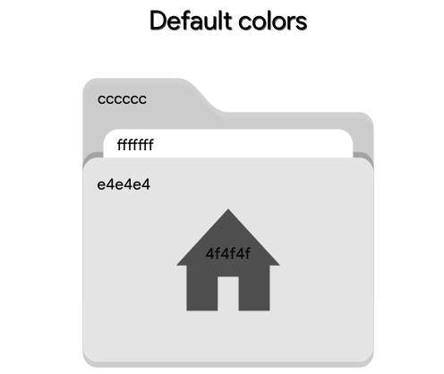

# Papirus Folder Icon Creator
This simple program generate folders icons for <a href="https://github.com/PapirusDevelopmentTeam/papirus-icon-theme">Papirus Icon Theme</a>!

# How to create
To create the icons, it is necessary to know the default colors of the icons! The standard colors are shown below!

    

After the previous step, go to the changecolors script, find the following line:

    colors=('4f4f4f' 'e4e4e4' 'ffffff' 'cccccc')
    newColors=('4f4f4f' 'e4e4e4' 'ffffff' 'cccccc')

Just put the new color or colors in the newColors array! The script will use the position of the two displayed arrays to change the colors, for example, if you want to change the color of the central icon, just change the color 4f4f4f in the newColors array and for another! The papirus has names for the colors used in the folders, when executing the script, it will ask for the name of the color or version of the icon pack!

# How to instal
After creation, you can install or not the icons! If you want to install, you will need to modify the following array in the papirus-folders script:

    local -a valid_colors=("black" "blue" "bluegrey" "breeze" "brown"
            "cyan" "deeporange" "green" "grey" "indigo" "magenta" "nordic"
            "orange" "palebrown" "paleorange" "pink" "purple" "red" "teal"
            "violet" "white" "yaru" "yellow")

This list has the version of the available icons, which are filtered by colors, just add the name of the version or color you gave to your pack, add it as it is in the array!
After that, just run the install!

# License
GNU GPL v2
